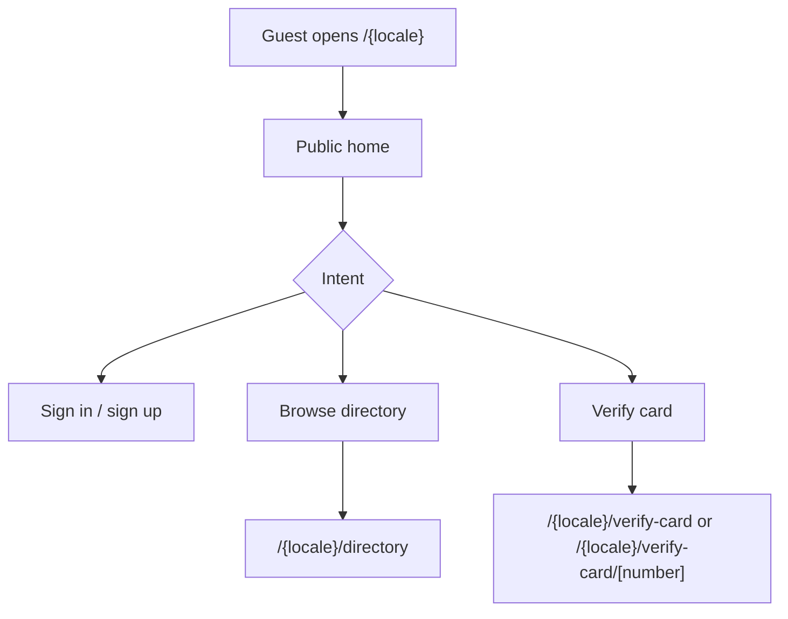
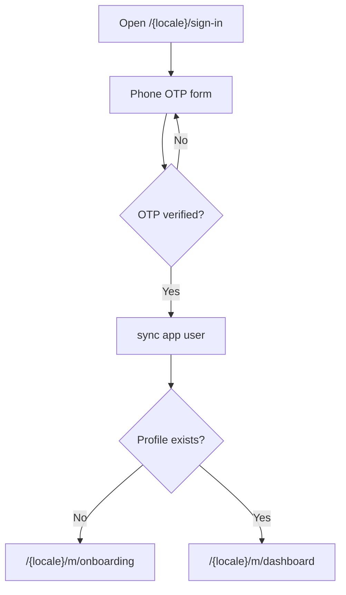
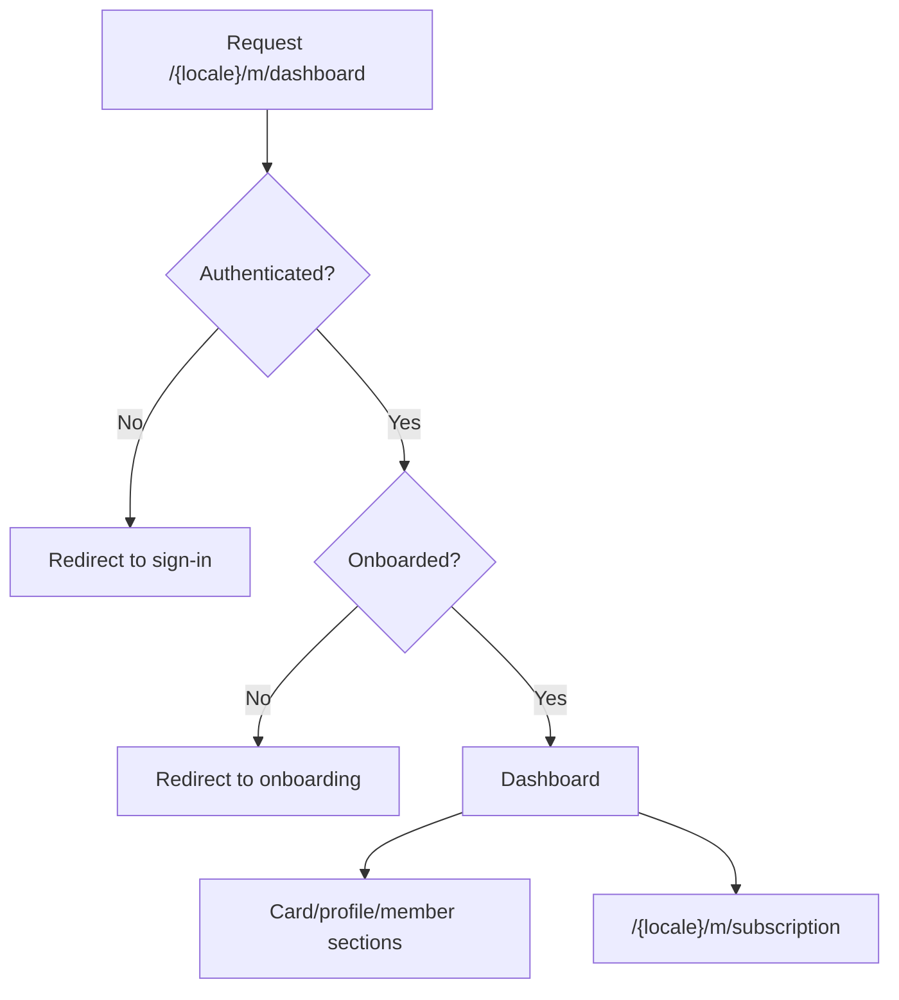
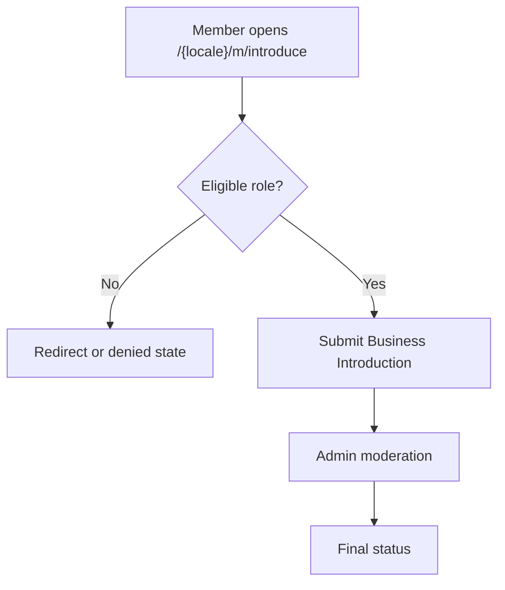
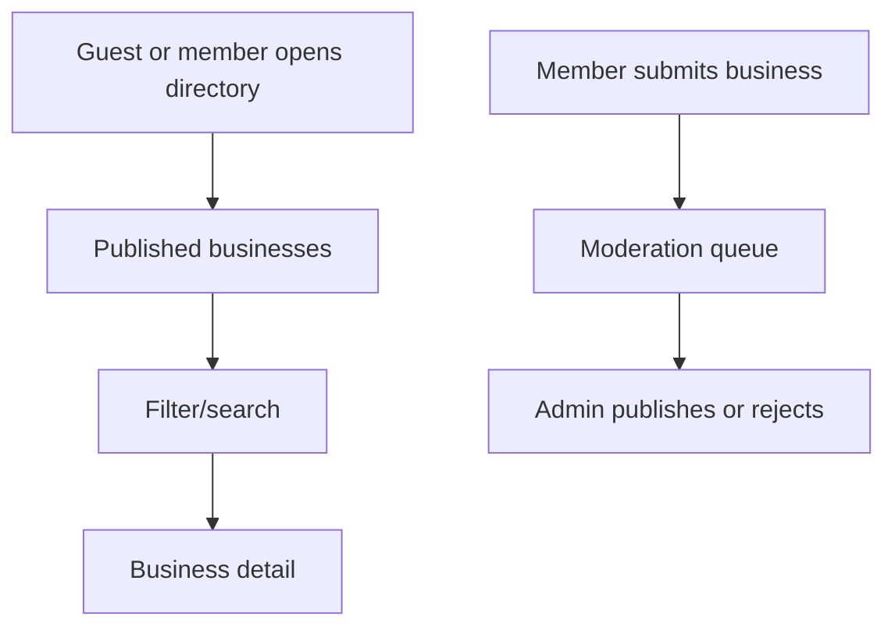
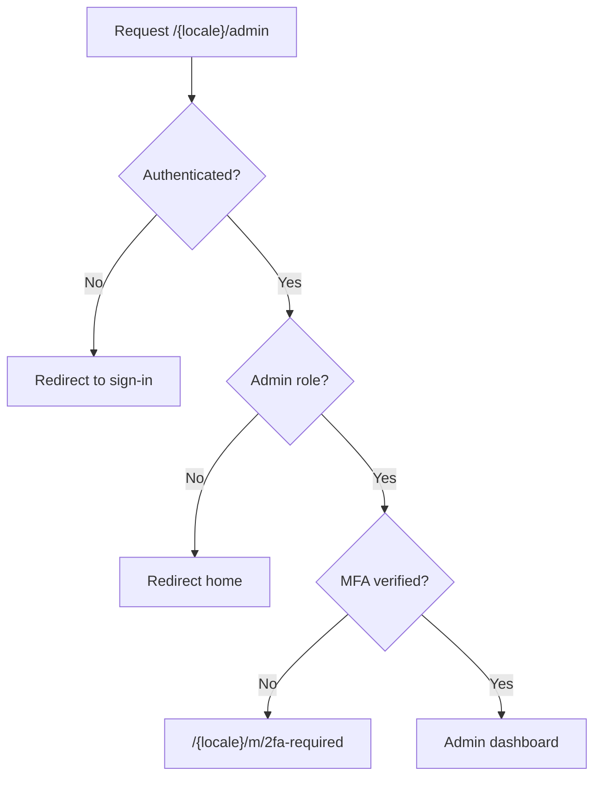
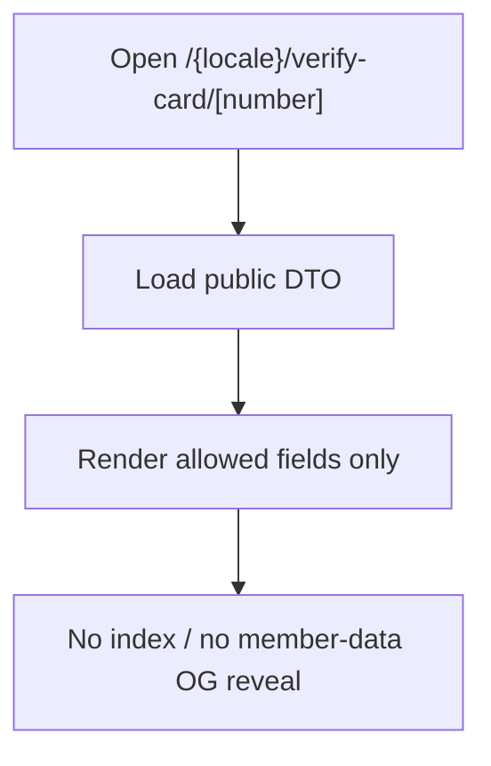

# User Flows and Product QA Map

Last refreshed: 2026-06-06.

This document maps the main `docs/SPEC.md` flows to the current repository
state. It is a QA map, not a replacement for the SPEC.

## Current Route Coverage

| Area | Current status |
| --- | --- |
| Guest/public | Home, directory, directory detail, verify-card lookup, verify-card detail, and legal routes exist. |
| Auth/onboarding | Phone-first Supabase Auth screens, sign-out, and onboarding route exist. |
| Member | Dashboard, introduce, subscription, business submission, checkout result, and 2FA-required routes exist. |
| Admin | Dashboard, profile, users, access/roles, businesses, catalog, cards, memberships, introductions, billing, references, and audit routes exist. |
| System | Robots, sitemap, Stripe webhook, admin export APIs, and protected admin-session API exist. |

## Guest Acquisition

QA notes:

- Public home and directory are in the Playwright smoke suite.
- Directory DTO coverage exists at contract level.
- Sprint 3 must decide final MVP behavior for the verify-card lookup page.

## Auth and Onboarding

QA notes:

- Intent separation, redirects, and phone auth helpers have test coverage.
- Positive seeded browser workflows remain Sprint 3 work.

## Member Dashboard and Subscription

QA notes:

- Dashboard and subscription routes exist.
- Billing reconciliation and selected lifecycle logic have Vitest coverage.
- Sprint 3 should add persona E2E for FREE, VIP, and BUSINESS states.

## Business Introduction

QA notes:

- Schema and moderation logic coverage exists in the legacy suite.
- Sprint 1 should migrate this legacy coverage after auth/billing.
- Sprint 3 should add positive browser coverage.

## Business Directory and Submission

QA notes:

- Public DTO coverage exists.
- Business submission schema coverage remains in legacy tests.
- Admin moderation needs stronger browser-level regression coverage.

## Admin Access and Operations

QA notes:

- Middleware/admin access contracts are covered.
- `/api/protected/admin-session` has contract tests.
- Admin exports have contract coverage, but Sprint 1 should expand route-handler
  assertions where coverage remains thin.

## Verify Card

QA notes:

- Public DTO contract is covered.
- `/{locale}/verify-card` exists as the lookup entry route, but final MVP lookup
  behavior must be confirmed in Sprint 3.

## Release QA Gaps

- Legacy `node:test` coverage still needs Vitest migration.
- Persona-based positive E2E is not complete.
- DB integration tests need an isolated Postgres/schema path.
- Nightly accessibility, visual, regression, and performance suites remain
  Sprint 2/Sprint 3 work.
