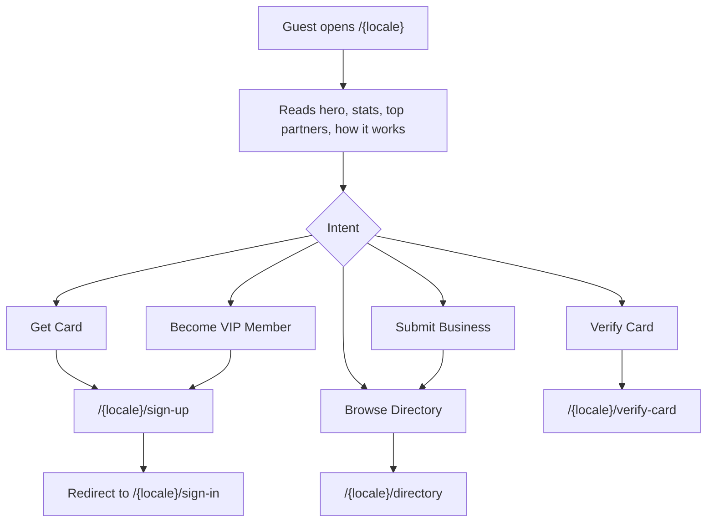
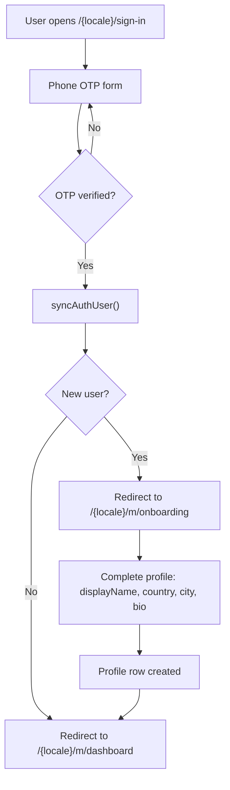
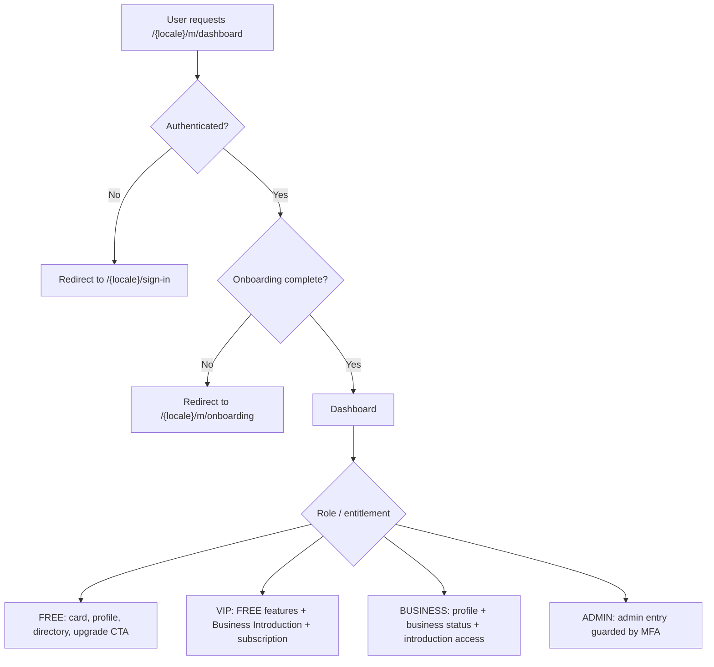
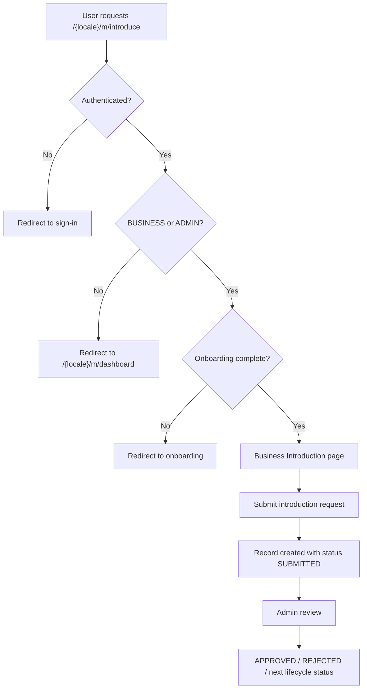
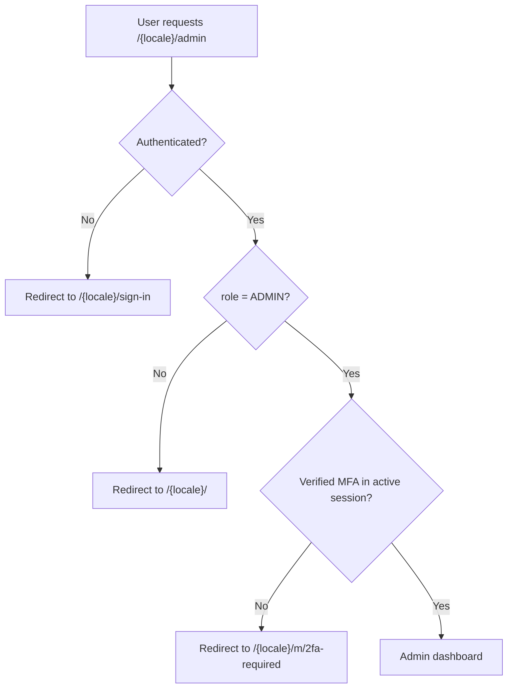
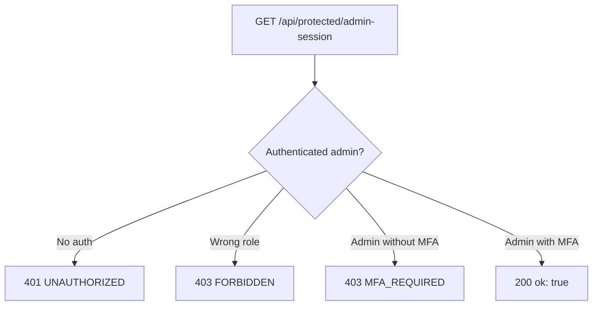
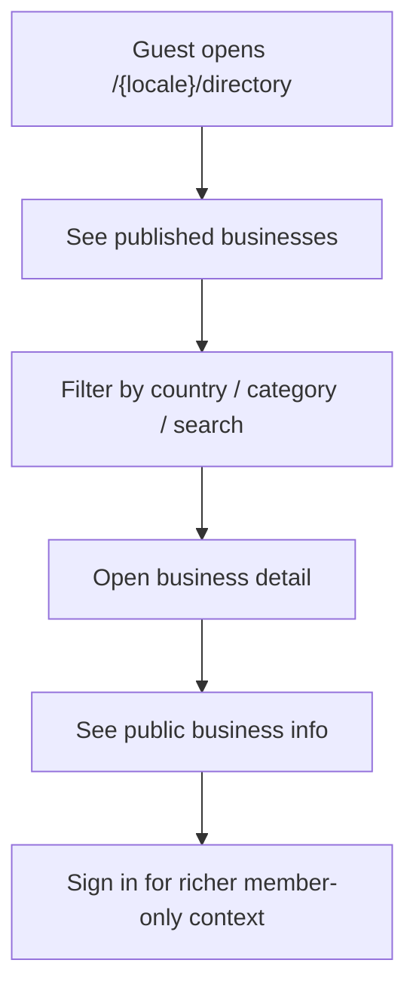
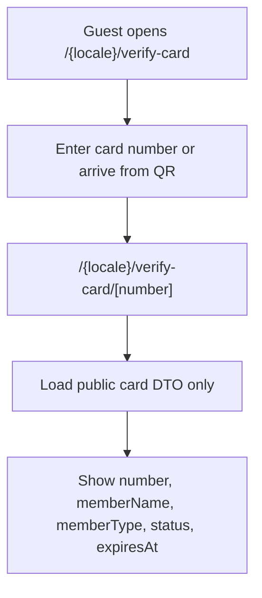
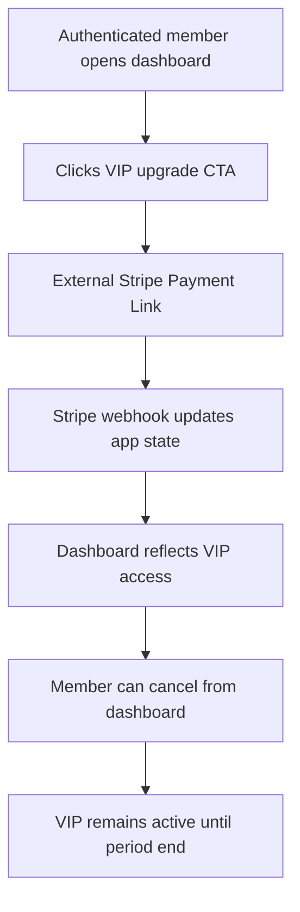
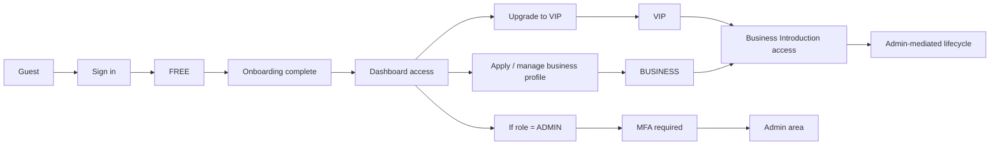

# User Flows

This document maps the main user flows from `docs/SPEC.md` to the current repository state.

Legend:
- `Implemented now` means the route or guard exists in `src/app` or `src/features`.
- `Specified next` means the flow is defined in `SPEC` or supported by schema/data helpers, but the final UI or route is not yet fully implemented.

## Current route coverage

### Implemented now

- `/{locale}`
- `/{locale}/sign-in`
- `/{locale}/sign-up` -> redirects to sign-in
- `/{locale}/sign-out`
- `/{locale}/m/onboarding`
- `/{locale}/m/dashboard`
- `/{locale}/m/introduce`
- `/{locale}/m/2fa-required`
- `/{locale}/admin`
- `/{locale}/directory`
- `/{locale}/verify-card`
- `/{locale}/legal/terms`
- `/{locale}/legal/privacy`
- `/{locale}/legal/cookie`
- `/{locale}/legal/contact`

### Specified next

- `/{locale}/directory/[slug]`
- `/{locale}/verify-card/[number]`
- `/{locale}/admin/users`
- `/{locale}/admin/businesses`
- `/{locale}/admin/introductions`
- `/{locale}/admin/cards`
- `/{locale}/admin/categories`
- `/{locale}/admin/countries`
- `/{locale}/admin/stripe-links`
- `/{locale}/admin/subscriptions`
- `/{locale}/admin/audit`
- `/{locale}/legal/refund`
- `/{locale}/legal/rules/club`
- `/{locale}/legal/rules/partner`
- `/{locale}/legal/rules/introduction`
- `/{locale}/legal/disclaimer`

## 1. Guest acquisition flow

Status: partially implemented now.

Notes:
- The three primary actions are already wired from the home page.
- `Get Card` and `Become VIP Member` currently funnel into auth first.
- `Submit Business` currently leads into discovery, not a dedicated business submission flow yet.

## 2. Auth and onboarding flow

Status: implemented now.

Notes:
- `/{locale}/sign-up` is intentionally a redirect into `/{locale}/sign-in`.
- Auth creates or syncs the app user record.
- Onboarding completion is determined by the existence of a profile row.

## 3. Member dashboard flow

Status: guard implemented now, final dashboard sections specified next.

Notes:
- The route exists and is protected.
- The page body is still a placeholder, but the role-based product model is already defined in `SPEC`.

## 4. Business Introduction flow

Status: access rules implemented now, full workflow specified next.

Notes:
- The route and guards already exist.
- The `introductions` table already exists, so the workflow has a data model foundation.
- `SPEC` says this flow is admin-mediated.

## 5. Admin access and MFA flow

Status: implemented now for root admin access.

Companion protected-session contract:

Notes:
- This is the cleanest fully enforced flow in the repo right now.
- The child admin sections from `SPEC` are not yet routed in `src/app`.

## 6. Public directory flow

Status: route implemented now, data helpers implemented now, final list/detail UI specified next.

Notes:
- The route currently renders a placeholder page.
- The data helper already restricts the list to `PUBLISHED` businesses.
- The slug detail route is still missing from `src/app`, but a helper already exists for it.

## 7. Verify card flow

Status: lookup entry route implemented now, final number route specified next.

Notes:
- The lookup page exists and is marked `robots: noindex`.
- The per-card public route described in `SPEC` is not yet present in `src/app`.
- The `club_cards` schema is already in place.

## 8. Billing lifecycle flow

Status: specified in `SPEC`, not yet fully implemented in routed UI.

Notes:
- The product contract is clear in `SPEC`.
- The UI and route-level flow still need to be completed in the app.

## 9. Role summary map

## 10. Repo reality summary

- The authentication and access-control backbone is already present.
- The onboarding flow is the most complete end-to-end user flow in the repo today.
- The admin entry flow with MFA is also concretely implemented.
- The directory, verify-card, dashboard, introduction, and admin content surfaces are still moving from placeholder or schema-backed state into full product pages.
