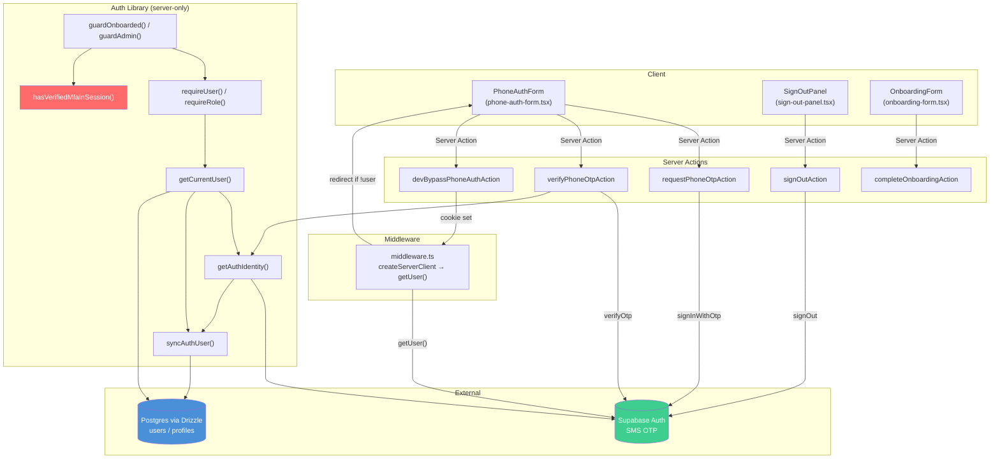

# Анализ архитектуры аутентификации и оценка текущего состояния миграции на Supabase Auth Phone

## Ключевой вывод

> [!IMPORTANT]
> **Миграция на Supabase Auth phone-first уже на ~90% завершена.** ADR-011 принят, Clerk полностью удалён из `package.json` и исходного кода, Supabase SSR-клиент подключён, phone-first OTP-флоу работает. Остались **cleanup-задачи и незакрытые gaps**, описанные ниже.

---

## 1. Что уже сделано (текущее состояние)

### ✅ Архитектурные решения

- [ADR-004](file:///g:/KYLYVNYK%20CLUB/kclub-mvp-V2/docs/STACK-DECISION.md#L189) (Clerk) помечен как `SUPERSEDED by ADR-011`
- [ADR-011](file:///g:/KYLYVNYK%20CLUB/kclub-mvp-V2/docs/STACK-DECISION.md#L248) (Supabase Auth phone-first) — `ACCEPTED`

### ✅ Зависимости

- `@clerk/nextjs` **удалён** из [package.json](file:///g:/KYLYVNYK%20CLUB/kclub-mvp-V2/package.json)
- `@supabase/ssr@0.10.3` и `@supabase/supabase-js@2.106.1` установлены
- Ноль импортов Clerk в `src/` (проверено grep)

### ✅ Supabase SSR-клиент

- [server.ts](file:///g:/KYLYVNYK%20CLUB/kclub-mvp-V2/src/lib/supabase/server.ts) — `createSupabaseServerClient()` с cookie-based сессией через `@supabase/ssr`
- [middleware.ts](file:///g:/KYLYVNYK%20CLUB/kclub-mvp-V2/src/middleware.ts) — Supabase auth cookie refresh, проверка `getUser()`, защита `/{locale}/m/*` и `/{locale}/admin/*`

### ✅ Phone-first auth flow

| Слой             | Файл                                                                                                                                                                                                       | Статус                                                                                          |
| ---------------- | ---------------------------------------------------------------------------------------------------------------------------------------------------------------------------------------------------------- | ----------------------------------------------------------------------------------------------- |
| Zod-схемы        | [phone.ts](file:///g:/KYLYVNYK%20CLUB/kclub-mvp-V2/src/features/auth/lib/phone.ts)                                                                                                                         | ✅ `phoneOtpRequestSchema`, `phoneOtpVerifySchema`                                              |
| Server Actions   | [phone-auth.action.ts](file:///g:/KYLYVNYK%20CLUB/kclub-mvp-V2/src/features/auth/actions/phone-auth.action.ts)                                                                                             | ✅ `requestPhoneOtpAction`, `verifyPhoneOtpAction`, `devBypassPhoneAuthAction`, `signOutAction` |
| Клиентский UI    | [phone-auth-form.tsx](file:///g:/KYLYVNYK%20CLUB/kclub-mvp-V2/src/features/auth/components/phone-auth-form.tsx)                                                                                            | ✅ 2-step form (phone → OTP code)                                                               |
| Sign-in page     | [page.tsx](file:///g:/KYLYVNYK%20CLUB/kclub-mvp-V2/src/app/%5Blocale%5D/sign-in/%5B%5B...sign-in%5D%5D/page.tsx)                                                                                           | ✅ Phone-first с i18n labels                                                                    |
| Sign-up redirect | [page.tsx](file:///g:/KYLYVNYK%20CLUB/kclub-mvp-V2/src/app/%5Blocale%5D/sign-up/%5B%5B...sign-up%5D%5D/page.tsx)                                                                                           | ✅ Redirect → sign-in                                                                           |
| Sign-out         | [page.tsx](file:///g:/KYLYVNYK%20CLUB/kclub-mvp-V2/src/app/%5Blocale%5D/sign-out/page.tsx) + [sign-out-panel.tsx](file:///g:/KYLYVNYK%20CLUB/kclub-mvp-V2/src/features/auth/components/sign-out-panel.tsx) | ✅                                                                                              |

### ✅ Identity resolution

- [auth-identity.ts](file:///g:/KYLYVNYK%20CLUB/kclub-mvp-V2/src/features/auth/lib/auth-identity.ts) — единая точка получения `AuthIdentity` из Supabase session или dev-bypass cookie
- [sync-auth-user.ts](file:///g:/KYLYVNYK%20CLUB/kclub-mvp-V2/src/features/auth/lib/sync-auth-user.ts) — upsert `users` row с `supabase_user_id` + `phone` + audit log
- [current-user.ts](file:///g:/KYLYVNYK%20CLUB/kclub-mvp-V2/src/features/auth/lib/current-user.ts) — `getCurrentUser()`, `requireUser()`, `requireRole()`

### ✅ DB-схема

- [user.ts](file:///g:/KYLYVNYK%20CLUB/kclub-mvp-V2/src/db/schema/user.ts) — `supabase_user_id` (unique), `phone` (unique, not null), `email` (unique, nullable)
- Нет `clerk_user_id` — колонка удалена

### ✅ Dev bypass

- [dev-auth.ts](file:///g:/KYLYVNYK%20CLUB/kclub-mvp-V2/src/features/auth/lib/dev-auth.ts) — base64url cookie для локального обхода SMS
- Middleware проверяет bypass + production guard

### ✅ Authorization

- [role-guards.ts](file:///g:/KYLYVNYK%20CLUB/kclub-mvp-V2/src/features/auth/lib/role-guards.ts) — `guardOnboarded`, `guardBusiness`, `guardAdmin`
- [admin-access.ts](file:///g:/KYLYVNYK%20CLUB/kclub-mvp-V2/src/features/auth/lib/admin-access.ts) — decision functions для admin API и routes

### ✅ Environment

- [env.ts](file:///g:/KYLYVNYK%20CLUB/kclub-mvp-V2/src/lib/env.ts) — `NEXT_PUBLIC_SUPABASE_URL`, `NEXT_PUBLIC_SUPABASE_PUBLISHABLE_KEY`, `AUTH_DEV_PHONE_BYPASS_ENABLED`
- [.env.example](file:///g:/KYLYVNYK%20CLUB/kclub-mvp-V2/.env.example) — Clerk vars удалены, Supabase vars добавлены
- [SECURITY.md](file:///g:/KYLYVNYK%20CLUB/kclub-mvp-V2/docs/SECURITY.md) — обновлён под Supabase Auth

---

## 2. Что НЕ завершено — оставшиеся gaps

### 🔴 Критические (блокируют production)

#### Gap 1: Мёртвый каталог `src/app/api/clerk/webhook/`

- Путь: [src/app/api/clerk/webhook/](file:///g:/KYLYVNYK%20CLUB/kclub-mvp-V2/src/app/api/clerk/webhook/)
- Содержит только `.gitkeep` — функциональности нет, но сам каталог — артефакт Clerk-эпохи
- **Действие:** удалить каталог `src/app/api/clerk/` целиком

#### Gap 2: MFA stub — admin доступ полностью заблокирован

- [mfa.ts](file:///g:/KYLYVNYK%20CLUB/kclub-mvp-V2/src/features/auth/lib/mfa.ts) — `hasVerifiedMfaInSession()` всегда возвращает `false`
- Это значит **ни один ADMIN не может пройти** в `/admin/*` — `guardAdmin()` всегда редиректит на `/m/2fa-required`
- ADR-011 говорит: _"Admin routes remain blocked behind the existing MFA requirement until a Supabase-compatible admin MFA policy is implemented"_
- **Решение требует проектного решения** (см. раздел «Open Questions»)

#### Gap 3: Нет Supabase Auth webhook для lifecycle-событий

- Clerk синхронизировал пользователей через webhooks (`user.created`, `user.updated`, `user.deleted`)
- Текущая реализация использует **inline sync** через `syncAuthUser()` при каждом запросе — это работает для создания, но:
  - Не обрабатывает удаление пользователя на стороне Supabase
  - Не обрабатывает смену телефона на стороне Supabase dashboard
- Supabase Auth поддерживает [Database Webhooks](https://supabase.com/docs/guides/auth/auth-hooks) и [Auth Hooks](https://supabase.com/docs/guides/auth/auth-hooks)
- **Действие:** оценить нужен ли webhook handler, или inline sync покрывает MVP-потребности

#### Gap 4: Отсутствует Turnstile-интеграция на phone auth form

- ADR-008 требует: _"Required on phone auth initiation if SMS abuse appears in logs"_
- Текущий [phone-auth-form.tsx](file:///g:/KYLYVNYK%20CLUB/kclub-mvp-V2/src/features/auth/components/phone-auth-form.tsx) **не содержит** Turnstile виджет
- [phone-auth.action.ts](file:///g:/KYLYVNYK%20CLUB/kclub-mvp-V2/src/features/auth/actions/phone-auth.action.ts) **не проверяет** Turnstile-токен и **не вызывает** rate-limiter
- **Действие:** добавить Turnstile + Upstash rate-limit для `requestPhoneOtpAction`

#### Gap 5: Нет Supabase browser client для `@supabase/ssr`

- Существует только [server.ts](file:///g:/KYLYVNYK%20CLUB/kclub-mvp-V2/src/lib/supabase/server.ts) — серверный клиент
- Клиентский (browser) Supabase client **отсутствует** — `src/lib/supabase/client.ts` не создан
- Текущий phone-auth flow работает через Server Actions, поэтому browser client может не понадобиться сейчас, но может потребоваться для real-time или client-side token refresh
- **Действие:** создать `src/lib/supabase/client.ts` с `createBrowserClient()` если потребуется client-side Supabase функциональность

---

### 🟡 Средний приоритет

#### Gap 6: Catch-all route segments `[[...sign-in]]` и `[[...sign-up]]`

- Пути: `src/app/[locale]/sign-in/[[...sign-in]]/page.tsx`, `src/app/[locale]/sign-up/[[...sign-up]]/page.tsx`
- Catch-all (`[[...]]`) — это **Clerk-паттерн** (для Clerk's hosted pages). Supabase Auth не нуждается в catch-all
- **Действие:** упростить до `src/app/[locale]/sign-in/page.tsx` и `src/app/[locale]/sign-up/page.tsx` (single segment)

#### Gap 7: Документация — stale Clerk-ссылки в docs

- [STACK-DECISION.md](file:///g:/KYLYVNYK%20CLUB/kclub-mvp-V2/docs/STACK-DECISION.md) — ADR-004 содержит историю Clerk (нормально, т.к. SUPERSEDED и не удаляется по конвенции)
- [sprint-2 docs](file:///g:/KYLYVNYK%20CLUB/kclub-mvp-V2/docs/sprints/kclub--mvp--sptint-2.md) — множество Clerk-ссылок в sprint-планах (139+ строк)
- [AGENTS.md](file:///g:/KYLYVNYK%20CLUB/kclub-mvp-V2/AGENTS.md) §3 Stack table — всё ещё упоминает `Clerk ^6`
- **Действие:** обновить `AGENTS.md` Stack table; sprint docs можно оставить как исторические

#### Gap 8: CSP-заголовки не настроены

- [SECURITY.md](file:///g:/KYLYVNYK%20CLUB/kclub-mvp-V2/docs/SECURITY.md) упоминает: _"Auth flows must allow the configured Supabase project origin"_
- Но фактическая CSP-конфигурация (headers в `next.config.ts` или middleware) **не реализована**
- `*.clerk.accounts.dev` больше не нужен, нужен домен Supabase проекта
- **Действие:** добавить CSP headers в `next.config.ts`

#### Gap 9: Тесты auth — покрытие минимальное

- Существуют: [admin-access.test.ts](file:///g:/KYLYVNYK%20CLUB/kclub-mvp-V2/tests/auth/admin-access.test.ts), [phone.test.ts](file:///g:/KYLYVNYK%20CLUB/kclub-mvp-V2/tests/auth/phone.test.ts) — unit-тесты чистых функций
- Нет E2E-теста: phone auth flow, sign-out, middleware redirect
- Нет PII shape assertion для public auth surfaces
- **Действие:** добавить Playwright smoke-тесты для auth flow

---

### 🟢 Низкий приоритет (Post-MVP)

#### Gap 10: Session refresh / token rotation

- Middleware делает `supabase.auth.getUser()` — это refreshes token, но нет явной обработки expired session (redirect to sign-in)
- Текущая логика корректна: если `user` null → redirect на protected routes. Но **нет обработки Supabase session expiry notification** на клиенте

#### Gap 11: `(auth)` route group пустой

- [src/app/(auth)/](<file:///g:/KYLYVNYK%20CLUB/kclub-mvp-V2/src/app/(auth)/>) содержит только `.gitkeep`
- Вероятно, задумывался для Clerk-hosted UI
- **Действие:** удалить или repurpose

---

## 3. Архитектурная диаграмма (текущее состояние)



> [!WARNING]
> Красный блок `hasVerifiedMfaInSession()` — stub, всегда `false`. Это блокирует весь admin-функционал.

---

## Open Questions

> [!IMPORTANT]
>
> ### Q1: Стратегия Admin MFA
>
> `hasVerifiedMfaInSession()` — stub. Какой подход выбрать?
>
> **Вариант A:** Supabase Auth MFA (TOTP) — Supabase поддерживает `supabase.auth.mfa.enroll()`, `supabase.auth.mfa.challenge()`, `supabase.auth.mfa.verify()`. Полноценный TOTP (Google Authenticator / Authy). Требует UI для enrollment + verification.
>
> **Вариант B:** Временный bypass MFA для ADMIN в dev/staging, с полной реализацией позже. `hasVerifiedMfaInSession()` возвращает `true` если `NODE_ENV !== 'production'` — позволяет тестировать admin-панель.
>
> **Вариант C:** Отложить admin-панель до реализации MFA. Текущее поведение — корректное по ADR-011.
>
> **Рекомендация:** Вариант B для немедленного unblock + Вариант A для production.

> [!IMPORTANT]
>
> ### Q2: Нужен ли Supabase Auth webhook?
>
> Inline sync через `syncAuthUser()` покрывает:
>
> - ✅ Первый вход (создаёт user row)
> - ✅ Повторный вход (обновляет `supabase_user_id`)
> - ❌ Удаление пользователя через Supabase Dashboard
> - ❌ Смена телефона через Dashboard
>
> Для MVP inline sync достаточен? Или нужен webhook handler `/api/supabase/auth-webhook`?

> [!IMPORTANT]
>
> ### Q3: Turnstile на SMS OTP — сейчас или позже?
>
> ADR-008 формулирует это как conditional: _"if SMS abuse appears in logs"_. Но SMS отправка стоит денег, и без rate-limit + captcha бот может слить весь SMS-бюджет Supabase.
>
> Реализовать Turnstile на `requestPhoneOtpAction` сейчас?

---

## Proposed Changes (если принято решение закрыть все gaps)

### Фаза 1: Cleanup & Critical Fixes

#### [DELETE] `src/app/api/clerk/` directory

Удалить мёртвый каталог Clerk webhook.

---

#### [DELETE] `src/app/(auth)/.gitkeep`

Удалить пустой route group.

---

#### [MODIFY] Sign-in route: flatten catch-all

Переместить `src/app/[locale]/sign-in/[[...sign-in]]/page.tsx` → `src/app/[locale]/sign-in/page.tsx`

#### [MODIFY] Sign-up route: flatten catch-all

Переместить `src/app/[locale]/sign-up/[[...sign-up]]/page.tsx` → `src/app/[locale]/sign-up/page.tsx`

---

#### [MODIFY] [AGENTS.md](file:///g:/KYLYVNYK%20CLUB/kclub-mvp-V2/AGENTS.md)

Обновить §3 Stack table: заменить `Clerk ^6` на `Supabase Auth (phone-first, @supabase/ssr)`.
Обновить §8: убрать ссылки на Clerk webhooks, добавить Supabase Auth cookie handling.

---

### Фаза 2: Security — Turnstile + Rate Limit (если Q3 = да)

#### [MODIFY] [phone-auth.action.ts](file:///g:/KYLYVNYK%20CLUB/kclub-mvp-V2/src/features/auth/actions/phone-auth.action.ts)

Добавить Turnstile verification + Upstash rate-limit check перед `signInWithOtp()`.

#### [MODIFY] [phone-auth-form.tsx](file:///g:/KYLYVNYK%20CLUB/kclub-mvp-V2/src/features/auth/components/phone-auth-form.tsx)

Добавить Turnstile виджет, передать token в action.

---

### Фаза 3: Admin MFA (если Q1 = вариант A или B)

#### [MODIFY] [mfa.ts](file:///g:/KYLYVNYK%20CLUB/kclub-mvp-V2/src/features/auth/lib/mfa.ts)

Вариант B: добавить dev bypass.
Вариант A: реализовать проверку Supabase MFA factors через `supabase.auth.mfa.getAuthenticatorAssuranceLevel()`.

#### [NEW] `src/app/[locale]/m/2fa-enroll/page.tsx` (только для варианта A)

TOTP enrollment page.

#### [NEW] `src/app/[locale]/m/2fa-verify/page.tsx` (только для варианта A)

TOTP challenge/verify page.

---

### Фаза 4: Supabase Auth Webhook (если Q2 = да)

#### [NEW] `src/app/api/supabase/auth-webhook/route.ts`

Handler для Supabase Auth webhook events (`user.deleted`, `user.updated`).

---

### Фаза 5: CSP & Tests

#### [MODIFY] [next.config.ts](file:///g:/KYLYVNYK%20CLUB/kclub-mvp-V2/next.config.ts)

Добавить security headers: CSP с Supabase project URL, HSTS, X-Frame-Options, etc.

#### [NEW] `tests/auth/phone-auth-flow.test.ts`

E2E smoke test для phone auth flow (с mock Supabase).

---

## Verification Plan

### Automated Tests

```bash
pnpm lint && pnpm typecheck && pnpm test && pnpm build
```

- Проверить что Clerk-каталоги удалены и не ломают import resolution
- Новые unit-тесты для Turnstile integration + MFA check
- E2E Playwright для auth flow

### Manual Verification

- Sign-in → OTP → dashboard redirect работает
- Sign-out → session cleared, protected routes redirect
- Admin routes: поведение MFA gate корректно (block или allow в зависимости от решения Q1)
- Grep: `grep -rI "clerk" src/ --include="*.ts" --include="*.tsx"` — ноль результатов
